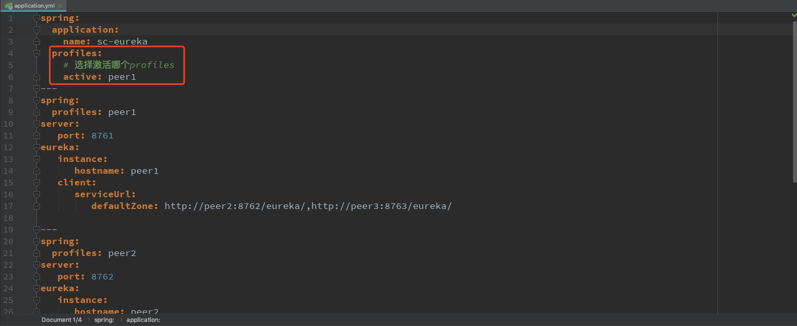

# sc-eureka启动

## 高可用注册中心快速启动

1. 去掉Single instance only的勾选：
    
2. 本案例使用三个eureka服务实现高可用，修改图中active的配置为peer1，peer2，peer3并依次启动三次
   
 
    注：如果三个eureka都在本机运行，则需要在hosts文件中添加以下内容
    ```bash
    127.0.0.1 peer1
    127.0.0.1 peer2
    127.0.0.1 peer3
    ```
3. 启动完成后，在浏览器中访问http://localhost:8761（或8762、8763都可以），出现以下效果则表示搭建完成：
  