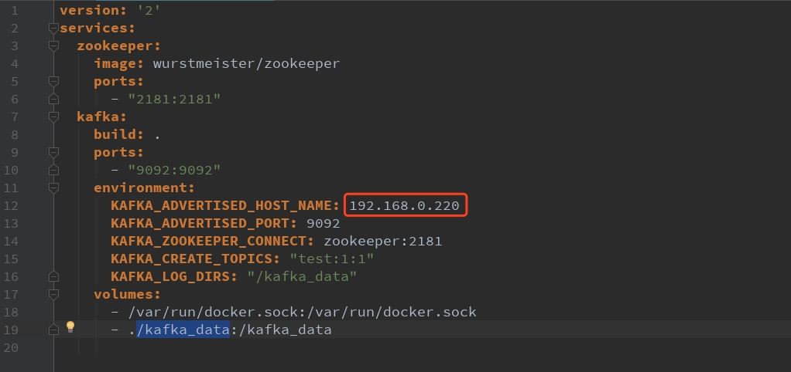
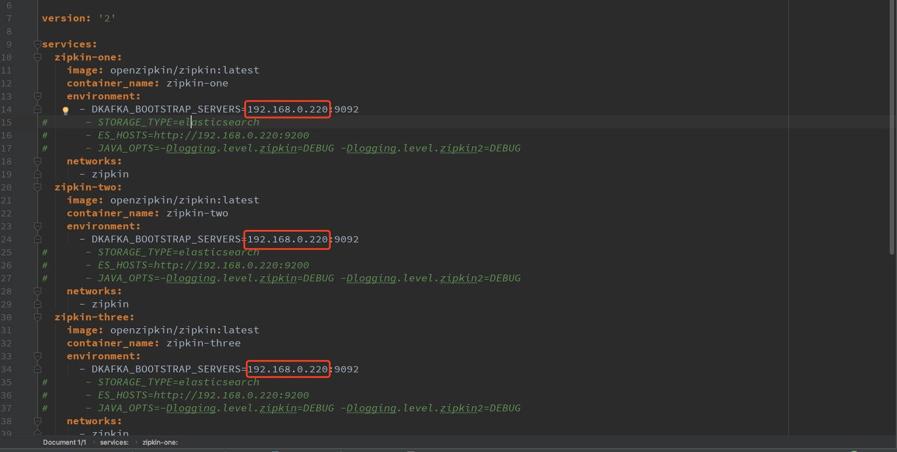

# 微服务启动

### 1. 启动zipkin
```bash
java -jar zipkin-server-2.12.9-exec.jar
```
在浏览器输入http://localhost:9411即可访问zipkin

### 2. 启动rabbitmq
```bash
rabbitmq-server
```
### 3. 启动kafka集群
1. 从github上下载kafka的docker-compose项目
    ```bash
    git clone https://github.com/wurstmeister/kafka-docker.git
    ```
2. 修改docker-compose.yml中的配置，如下图
      
* 注意：不能修改成localhost或127.0.0.1

3. 启动（切换到kafka-docker目录下）
    ```bash
    docker-compose up --build
    ```

相关下载链接：[kafka-docker](https://github.com/wurstmeister/kafka-docker)

### 4. 启动ELK集群
1. 从github上下载ELK的docker-compose项目
    ```bash
    git clone https://github.com/deviantony/docker-elk.git
    ```
2. 首次运行需要build（切换到docker-elk目录下）
    ```bash
    docker-compose build
    ```
3. 修改相关配置
* 修改docker-compose.yml，修改后的内容如下图：
 
 
* 添加logstash的pipeline（管道），以便从kafka中抓取数据，如下图：
 
4. 启动（切换到docker-elk目录下）
    ```bash
    docker-compose up
    ```
5. 在浏览器中输入http://localhost:5601即可访问kibana
    * 账号：elastic
    * 密码：changeme

相关下载链接：[docker-elk](https://github.com/deviantony/docker-elk)

### 5. 启动注册中心sc-eureka
### 6. 启动配置中心sc-config
相关：
1. 配置中心中的文件更新时，用post方式调用http://localhost:9999/actuator/bus-refresh接口，可动态更新配置，命令如下：
```bash
curl http://localhost:9999/actuator/bus-refresh -X POST
```
### 7. 启动网关sc-gateway
### 8. 启动业务相关的微服务