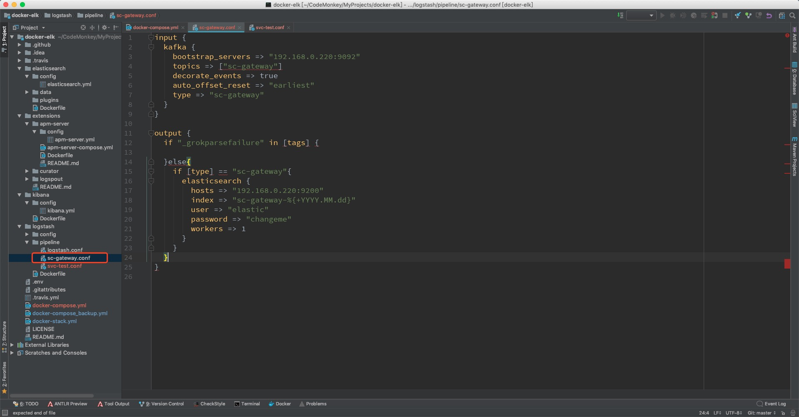
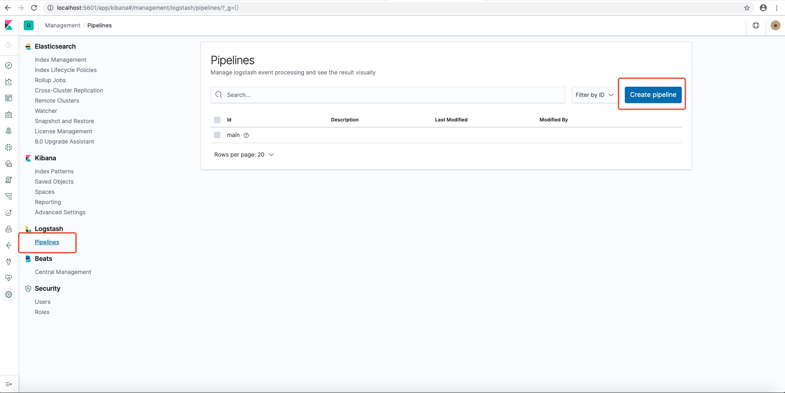

# 微服务启动

### 1. 启动zipkin
1. 修改相关配置（待完善）
2. 启动
* 方法一：切换到components/docker-zipkin-cluster目录下，启动docker-compose：
    ```bash
    docker-compose up --build
    ```
相关下载链接：[zipkin-lb-compose](https://github.com/Dan70402/zipkin-lb-compose)

* 方法二：使用jar包启动
* zipkin在web方式下启动：
```bash
java -jar zipkin-server-2.12.9-exec.jar
```
* zipkin在kafka方式下启动，把收集的信息推到kafka(会自动创建名为zipkin的Topic)，最终保存到elasticsearch中：
```bash
java -DKAFKA_BOOTSTRAP_SERVERS=192.168.0.220:9092 -jar zipkin-server-2.12.9-exec.jar
```
注：上条命令去掉-DSTORAGE_TYPE似乎也可以正常运行，此条命令当做备份
```bash
java -DKAFKA_BOOTSTRAP_SERVERS=192.168.0.220:9092 -DSTORAGE_TYPE=elasticsearch -DES_HOSTS=http://192.168.0.220:9200 -jar zipkin-server-2.12.9-exec.jar
```
* 在浏览器输入http://localhost:9411即可访问zipkin

### 2. 启动rabbitmq
1. 修改相关配置（待完善）
2. 切换到components/docker-rabbitmq-cluster目录下，启动docker-compose：
    ```bash
    docker-compose up --build
    ```
相关下载链接：[docker-rabbitmq-cluster](https://github.com/pardahlman/docker-rabbitmq-cluster)

### 3. 启动kafka集群
1. 切换到components/docker-kafka目录下，修改docker-compose.yml中的配置，如下图
      
* 注意：不能修改成localhost或127.0.0.1

2. 切换到components/docker-kafka目录下，启动docker-compose：
    ```bash
    docker-compose up --build
    ```
相关下载链接：[kafka-docker](https://github.com/wurstmeister/kafka-docker)

### 4. 启动ELK集群
1. 添加logstash的pipeline（管道）
    * 方法一：在components/docker-elk/logstash/pipeline/路径下添加
     
    * 方法二（暂时验证不通过，先mark）：登陆Kibana网页端后，找到Logstash——>Pipelines，点击Create pipeline创建
     
2. 切换到components/docker-elk目录下，启动docker-compose：
    ```bash
    docker-compose up --build
    ```
3. 在浏览器中输入http://localhost:5601即可访问kibana
    * 账号：elastic
    * 密码：changeme

相关下载链接：[docker-elk](https://github.com/deviantony/docker-elk)

### 5. 启动注册中心sc-eureka
### 6. 启动配置中心sc-config
相关：
1. 配置中心中的文件更新时，用post方式调用http://localhost:9999/actuator/bus-refresh接口，可动态更新配置，命令如下：
```bash
curl http://localhost:9999/actuator/bus-refresh -X POST
```
### 7. 启动网关sc-gateway
### 8. 启动业务相关的微服务